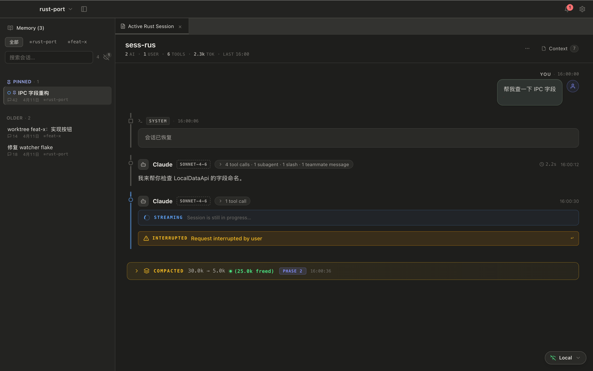
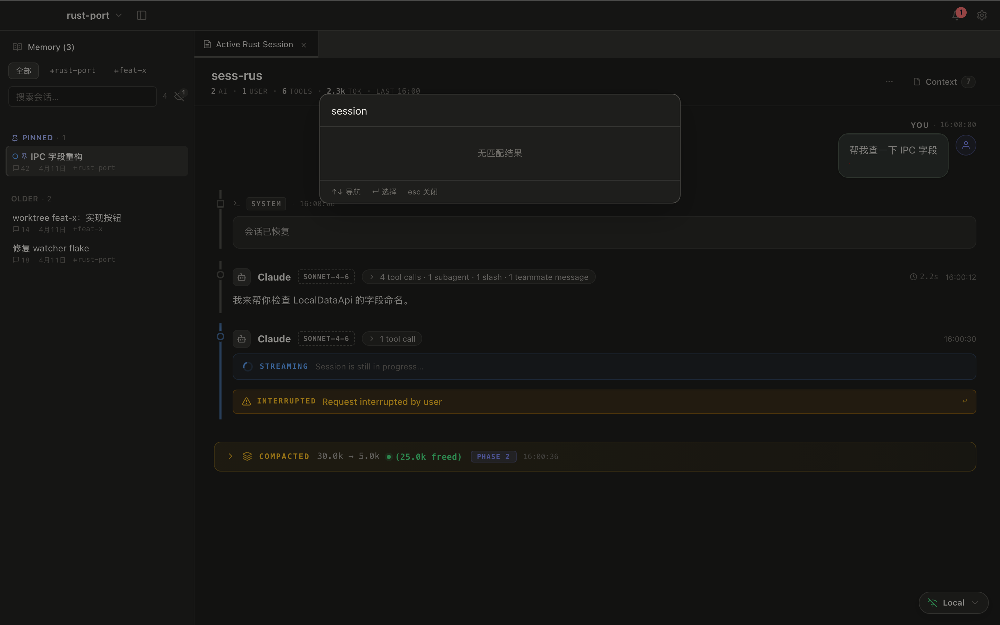
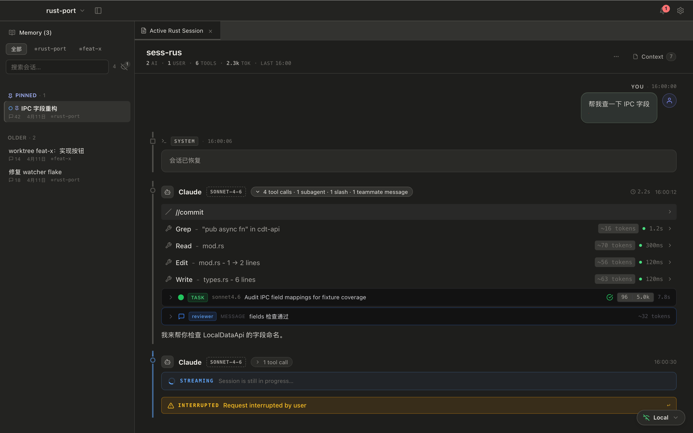

<h1 align="center">claude-devtools-rs</h1>

<p align="center">
  <strong>看清 Claude Code 做过的每一步 —— 本地、秒开。</strong>
</p>

<p align="center">
  <sub>可视化 Claude Code 会话执行的原生桌面应用。读取本机 <code>~/.claude/</code> 下已有的日志，
  重建完整轨迹：文件路径、diff、思考过程、子代理、token 消耗。不需要账号、不需要 API key、不上传数据。</sub>
</p>

<p align="center">
  <a href="https://github.com/snowzhaozhj/claude-devtools-rs/releases/latest"></a>&nbsp;
  <a href="https://github.com/snowzhaozhj/claude-devtools-rs/releases"></a>&nbsp;
  <a href="https://github.com/snowzhaozhj/claude-devtools-rs/stargazers"></a>&nbsp;
  &nbsp;
  &nbsp;
  <a href="LICENSE"></a>
</p>

<p align="center">
  <a href="https://github.com/snowzhaozhj/claude-devtools-rs/releases/latest"></a>&nbsp;&nbsp;
  <a href="https://github.com/snowzhaozhj/claude-devtools-rs/releases/latest"></a>&nbsp;&nbsp;
  <a href="https://github.com/snowzhaozhj/claude-devtools-rs/releases/latest"></a>
</p>

<p align="center">
  <a href="./README.md">English</a> · <strong>简体中文</strong>
</p>

<p align="center">
  
</p>

---

## 为什么

**Claude Code 把它做的事藏起来了。** 终端把每一步折叠成一行摘要 —— `Read 3 files`、
`Searched for 1 pattern`、`Edited 2 files` —— 没有路径、没有内容、没有 diff。思考过程不可见，
子代理活动被埋没，上下文窗口只是一条三段式进度条没有细分。唯一的逃生口是 `--verbose`，
它会把原始 JSON 和成千上万行噪声一股脑倒出来。没有中间地带。

**claude-devtools-rs 读取本机 `~/.claude/` 下已有的日志，把一切重建出来** —— 在一个原生桌面应用里，
不是浏览器标签页，也不是 Electron 壳。

| 终端隐藏的 | claude-devtools-rs 展示的 |
|---|---|
| `Read 3 files` | 精确路径、带行号的语法高亮内容 |
| `Searched for 1 pattern` | 匹配模式、每个命中文件、命中行 |
| `Edited 2 files` | 行内 diff，增删高亮 |
| 三段式上下文条 | 按类别的 token 归因（CLAUDE.md、skills、@ 文件、工具 I/O、思考……） |
| 折叠的子代理输出 | 每个 agent 的完整执行树 + token / model / 异常指标 |
| 思考完全不可见 | 完整渲染的 extended thinking |
| `--verbose` JSON 倾倒 | 结构化、可搜索、可导航的界面 |

**用 Rust + Tauri 构建** —— 它是 Electron 版
[claude-devtools](https://github.com/matt1398/claude-devtools) 的端口，为性能重写：
千条消息的会话能在一秒内打开，idle CPU 接近零，挂在后台不会让风扇起转。

**所有数据留在本地。** 不需要账号、不需要 API key、无任何网络调用 —— 只读你磁盘上已有的文件，
并在会话运行时实时刷新视图。

---

## 截图

<table>
  <tr>
    <td width="50%"></td>
    <td width="50%"></td>
  </tr>
  <tr>
    <td align="center"><sub><b>会话详情</b> —— 执行轨迹、工具卡片、行内 diff</sub></td>
    <td align="center"><sub><b>侧边栏 + 搜索</b> —— 项目、实时会话列表、<code>Cmd+K</code></sub></td>
  </tr>
  <tr>
    <td colspan="2"></td>
  </tr>
  <tr>
    <td colspan="2" align="center"><sub><b>工具查看器</b> —— Read / Edit / Write / Bash 各有专用视图 + 语法高亮</sub></td>
  </tr>
</table>

---

## 特性

- **会话浏览**：扫描 `~/.claude/projects/`，按项目聚合历史 session 并实时跟进正在运行的会话。
- **执行轨迹**：UserChunk / AIChunk / SemanticStep 分段 + Tool 调用卡片（Read / Edit / Write / Bash / 自定义 agent）。
- **Subagent 视图**：内嵌 ExecutionTrace，token / model / 异常指标一览。
- **Context Panel**：CLAUDE.md、slash command、@ 文件引用等上下文注入分类统计。
- **全局搜索 + 命令面板**：`Cmd+F` 当前 session，`Cmd+K` 跨 session。
- **实时刷新**：FileWatcher debounce → IPC emit → 前端 in-place patch，无"加载中"闪烁。
- **桌面通知 + 系统托盘**：可自定义触发器，Dock 未读 badge（macOS）。
- **SSH 远端会话**：通过 SSH 查看远程机器上的会话。
- **Browser Access**：可选开启本机 HTTP server，在浏览器打开同一套 UI。
- **主题**：浅色 / 深色 / 跟随系统。
- **CLI + MCP/Skills**：终端查询 session 数据，或让 Claude Code 查询自己的会话（见 [Claude Code 集成](#claude-code-集成)）。
- **高性能**：多轮 IPC payload 瘦身（lazy markdown、image `asset://` 懒加载、subagent / tool output 懒拉），千条消息 session 仍能秒开。

---

## 安装

### 桌面应用

从 [Releases](https://github.com/snowzhaozhj/claude-devtools-rs/releases) 下载对应平台安装包：

- **macOS**：`.dmg`（Apple Silicon / Intel）
- **Linux**：`.deb` / `.AppImage`
- **Windows**：`.msi` / `.exe`

> 应用未经过 Apple Developer ID 签名（仅 ad-hoc 签名）/ Windows 代码签名。
>
> **macOS 首次打开**：从 `.dmg` 拖到 `/Applications` 后，**右键 → 打开**（不是双击），点"打开"确认。
> 若仍被拦截，"系统设置 → 隐私与安全性"里会有"仍要打开"选项。
> 如果提示 "已损坏，无法打开"（浏览器下载会带 quarantine 属性），在终端跑：
> ```bash
> sudo xattr -rd com.apple.quarantine "/Applications/Claude DevTools.app"
> ```
>
> **Windows**：SmartScreen 会拦 → "更多信息" → "仍要运行"。

### CLI (`cdt`)

CLI 工具用于终端查询 session 数据、搭配 Claude Code MCP/Skills 使用。

**一键安装**（macOS / Linux）：

```bash
curl -fsSL https://raw.githubusercontent.com/snowzhaozhj/claude-devtools-rs/main/install.sh | sh
```

**其它方式：**

| 方式 | 命令 |
|---|---|
| 手动下载 | 从 [Releases](https://github.com/snowzhaozhj/claude-devtools-rs/releases) 下载 `cdt-{platform}.tar.gz` |
| 从源码编译 | `cargo install --git https://github.com/snowzhaozhj/claude-devtools-rs cdt-cli` |

安装后运行 `cdt setup mcp --apply` 注册 MCP server，或 `cdt setup skills` 安装 session 分析 skill。
用 `cdt self-update` 升级（或重新跑安装脚本）。

**环境变量：**

| 变量 | 作用 | 默认值 |
|---|---|---|
| `CDT_INSTALL_DIR` | 自定义安装目录 | `~/.local/bin` |
| `CDT_VERSION` | 指定版本（如 `v0.5.14`） | 自动检测最新 |

---

## Claude Code 集成

`cdt` CLI 提供两种方式与 Claude Code 协作：**MCP Server** 和 **Skills**。

### MCP Server

将 `cdt` 注册为 Claude Code 的 MCP server，让 Claude 直接调用 session 查询工具：

```bash
cdt setup mcp --apply              # 自动注册
# 或手动执行：
claude mcp add cdt-devtools -- cdt mcp serve
```

注册后 Claude Code 可使用 `list_projects`、`list_sessions`、`search_sessions`、
`get_session_detail`、`get_session_stats` 等工具。

### Skills（推荐）

```bash
cdt setup skills                   # 安装到 .claude/skills/
cdt setup skills --force           # 强制覆盖已有文件
```

安装 `session-insights` skill，涵盖错误分析、token 消耗统计、全文搜索、单 session 诊断。
在 Claude Code 中用 `/session-insights` 触发，或直接描述需求自动匹配。Skill 直接调用 `cdt` CLI，无需 MCP 配置。

---

## Browser Access

在 *Settings → General → Browser Access* 中开启本机 HTTP server。开启后应用会显示
`http://localhost:<port>`（默认端口 `3456`）；在 Chrome 或其它浏览器打开该 URL 即可访问同一套 UI。

**安全模型**：server 只监听 `127.0.0.1`，CORS 只放行 `localhost` / `127.0.0.1` 来源，不提供 token 或密码鉴权。
它适合本机浏览器、iframe 嵌入或本机脚本调用；不会暴露到 LAN。若需远程访问，请自行在外层配置反向代理、TLS 与鉴权。

桌面专属能力（系统托盘、Dock badge、OS native notification、应用内更新、Rosetta 检测）不会在浏览器中提供，相关入口会隐藏或禁用。

---

## 从源码构建

依赖：Rust stable（`rust-toolchain.toml` 锁 1.85+）、Node.js 20+、[pnpm](https://pnpm.io/) 8+、[just](https://github.com/casey/just)。

```bash
brew install just pnpm      # 没装先装
just bootstrap              # 首次装前端依赖（走 pnpm install）
just dev                    # 启动桌面应用 dev 模式
```

> 本仓用 pnpm（不是 npm）管前端依赖，lockfile 为 `ui/pnpm-lock.yaml`。worktree 切换 / rebase 后跑 `pnpm --dir ui install` 同步依赖。

常用 recipe（完整列表 `just` 或 `just -l`）：

| 命令 | 作用 |
|---|---|
| `just build` | workspace 编译 |
| `just build-tauri` | 构建桌面应用 |
| `just test` | Rust + 前端全测 |
| `just lint` | clippy 严格模式 |
| `just fmt` | rustfmt |
| `just check-ui` | svelte-check + tsc |
| `just test-e2e` | Playwright user story 测试 |
| `just preflight` | fmt + lint + test + spec-validate 一把梭 |

### 浏览器调试 UI（不开 Tauri 窗口）

```bash
pnpm --dir ui run dev
# 浏览器打开 http://127.0.0.1:5173/?mock=1&fixture=multi-project-rich
```

`?mock=1` 启用 dev-only mockIPC，所有 Tauri command 走 fixture 数据（`empty` / `single-project` / `multi-project-rich`）。production bundle 完全不含 mockIPC（vite DCE 验证）。

---

## 项目结构

```
crates/
├── cdt-core       # 共享类型（no runtime deps）
├── cdt-parse      # session-parsing
├── cdt-analyze    # chunk-building / tool-linking / context-tracking / team-metadata
├── cdt-discover   # project-discovery / session-search
├── cdt-watch      # file-watching
├── cdt-config     # configuration-management / notification-triggers
├── cdt-ssh        # ssh-remote-context
├── cdt-api        # ipc-data-api / http-data-api
└── cdt-cli        # 二进制 entrypoint (`cdt`)
ui/                # Svelte 5 + Vite 前端
src-tauri/         # Tauri 2 Rust 后端（excluded from workspace）
openspec/
├── specs/                       # 行为契约真相源（authoritative）
└── TS_BASELINE_DEVIATIONS.md    # TS port 偏差预警
```

---

## 开发与贡献

`main` 是发布分支，**不直接提交**。日常开发走 feature 分支 + PR：

```bash
git checkout -b feat/xxx
# ...改代码
just preflight
git commit -m "..."
git push -u origin feat/xxx
gh pr create --base main
```

PR 合入前 CI（`.github/workflows/ci.yml` 跑 fmt / clippy / test）必须全绿。项目约定与架构见
[`CLAUDE.md`](./CLAUDE.md)；行为契约见 `openspec/specs/<capability>/spec.md`。

## 发布流程

版本号同步在三处：`Cargo.toml`（workspace）、`src-tauri/Cargo.toml`、`src-tauri/tauri.conf.json`。

```bash
git checkout main && git pull
just release-check          # 验版本一致 + 工作树干净 + preflight
git tag v0.2.0
git push origin v0.2.0      # 触发 .github/workflows/release.yml
```

tag 构建（`tauri-apps/tauri-action`）产出 macOS arm64/x64 + Linux + Windows 安装包到 Draft Release。
应用集成 `tauri-plugin-updater` 实现应用内自动升级（macOS / Windows / Linux AppImage；`.deb` 不支持）。
发布历史见 [CHANGELOG.md](CHANGELOG.md)。

## 开发者文档

- **项目约定 / 架构要点**：[`CLAUDE.md`](./CLAUDE.md)
- **行为契约**：`openspec/specs/<capability>/spec.md`
- **OpenSpec workflow**：[`openspec/README.md`](./openspec/README.md)

## License

[MIT](LICENSE)
